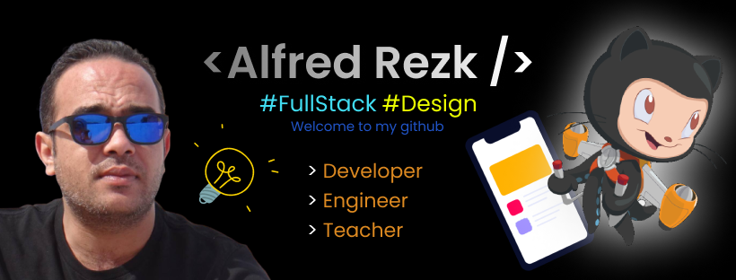

<h1 align="center"> Hi there 👋, my name is Alfred </h1>

- 🔭 𝙸’𝚖 𝚌𝚞𝚛𝚛𝚎𝚗𝚝𝚕𝚢 𝚠𝚘𝚛𝚔𝚒𝚗𝚐 𝚘𝚗 **Web dev projects** 
- 🌱 𝙸’𝚖 𝚌𝚞𝚛𝚛𝚎𝚗𝚝𝚕𝚢 𝚕𝚎𝚊𝚛𝚗𝚒𝚗𝚐 **Native apps development**
- 👯 𝙸’𝚖 𝚕𝚘𝚘𝚔𝚒𝚗𝚐 𝚝𝚘 𝚌𝚘𝚕𝚕𝚊𝚋𝚘𝚛𝚊𝚝𝚎 𝚘𝚗 **𝙳𝚊𝚝𝚊 𝚂𝚌𝚒𝚎𝚗𝚌𝚎 and 𝚆𝚎𝚋 𝙳𝚎𝚟𝚎𝚕𝚘𝚙𝚖𝚎𝚗𝚝**
- 💬 𝙰𝚜𝚔 𝙼𝚎 𝙰𝚋𝚘𝚞𝚝 𝙰𝚗𝚢𝚝𝚑𝚒𝚗𝚐 [here](https://github.com/AlfredRezk) ! 𝙸 𝚊𝚖 𝚑𝚊𝚙𝚙𝚢 𝚝𝚘 𝚑𝚎𝚕𝚙.
- 😄 𝙿𝚛𝚘𝚗𝚘𝚞𝚗𝚜 : **𝙷𝚎/𝙷𝚒𝚖/𝙷𝚒𝚜**
- ⚡ 𝙵𝚞𝚗 𝚏𝚊𝚌𝚝 : **Coding is Fun**

## Languages and Tools 
 

<h4 align="left">Front End</h4>

 
  

  
  

  
  

  

<h4 align="left">Backend, database and BaaS</h4>

 
 
  
  
  

<h4 align="left">Mobile Apps</h4>

  
 

### Tools

 
 

<h4 align="left">Other</h4>

  

